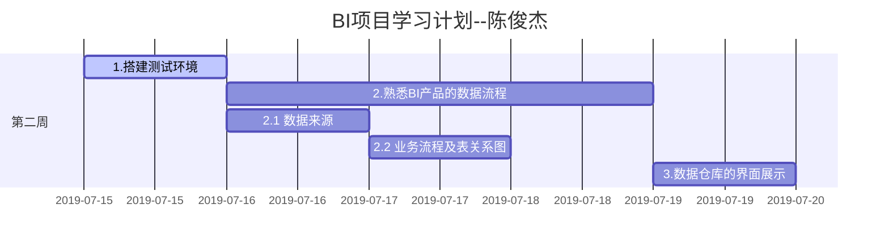

<h1 align="center">Winning实习规划</h1>

</br>

</br>

</br>





</br>

<h2 align="center">目录</h2>

[TOC]

# 部署运营决策支持系统


## 环境准备

> `卫宁健康运营决策支持系统`需要在一定硬件、软件环境支持下才能运行。本章主要讲述对运行环境的要求，请在安装之前仔细核查环境是否达到要求。

### 服务器运行环境

> - 1、系统环境：windos server 2008R2及以上，
>   - 注意：
>
>     > - 1、企业版；
>     >
>     > - 2、64版本
> - 2、软件环境：SQL server 2008R2及以上，
>   - 注意：
>
>     > - 1、二进制实例；
>     > - 2、全组件（SSIS、SSRS、SSAS）
>
>   - 注意：数据库实例为二进制

### NET Framework4.0环境安装

- 检查机器是否安装.Net Framework 4.0

  > 如下：在计算机`C:\Windows\Microsoft.NET\Framework`文件夹下查看是否有4.0文件夹，若无，请网上下载 .Net Framework 4.0，并安装。


### IIS环境搭建

> ​      打开`控制面板`，找到`程序与功能`，点进去，**选择`打开或关闭Windows功能`**


- 勾选如图所示功能
- **点击确定，等待安装完成**
- 安装成功后，在`控制面板->管理工具`中即可看到IIS管理器


## 网站部署

### 服务器端部署

> IIS网站部署，如果没有IIS，请先安装IIS环境，然后按照以下步骤操作：

####  添加网站

- 框架部署包拷到合适的路径下。

- 打开`IIS管理器`选择左侧网站选项，右击选择”添加网站”。


> **在弹出的添加网站界面**
>
> - 填写网站名称`决策支持`
> - 物理路径（框架文件所在路径）
> - 分配端口号（端口号必须大于8000）
>   - 如：8088（如端口被占用，则换用其他端口号，保证端口号没有冲突），
> - 再点击确定，在网站界面就可以看到这一网站了。


- 点击如下所示，在主页上双击 `ISAPI和CGI限制`


- 将`ASP.NET`的限制 改为 允许 ，如下图所示：


> 选择`应用程序池`，在右侧列表中选择上一步配置的网站决策支持同名应用池,双击进入配值界面，
>
> - .NET Framework版本选择.NET FRAMEWORK 4.0版本；
> - 托管管道模式选择“经典”，点击确定。操作如下图所示：


#### 修改web.config

> - 打开框架文件夹里面的`web.config`文件，找到`sys_id`，修改为`2`

```xml
<add key="sys_id" value="2" />
```

### 数据库连接配置

```xml
<!-- 数据库连接字符串-->
  <connectionStrings>
    <!--sql数据库连接（ConnectionString：框架库；hisConnectionString：HOSPITAL_CUBEDB库）-->
    <add name="ConnectionString" connectionString="server=.;uid=sa;pwd=junjc9;database=PLATFORM_TYPT;" />
    <add name="hisConnectionString" connectionString="server=.;uid=sa;pwd=junjc9;database=HOSPITAL_CUBEDB;" />
    <!--This4ConnectionString：his库，实时监控连接-->
    <add name="This4ConnectionString" connectionString="server=.;uid=sa;pwd=biadmin;database=THIS4_BS;" />
    <!--oracle数据库连接（OraConnectionString：框架库；OrahisConnectionString：HOSPITAL_CUBEDB库）-->
    <add name="OraConnectionString" connectionString="Data Source=(DESCRIPTION=(ADDRESS=(PROTOCOL=TCP)(HOST=172.17.1.233)(PORT=1521))(CONNECT_DATA=(SERVICE_NAME=ORCL)));User Id=PLATFORM_TYPT;Password=p1t2t3" providerName="System.Data.OracleClient" />
    <add name="OrahisConnectionString" connectionString="Data Source=(DESCRIPTION=(ADDRESS=(PROTOCOL=TCP)(HOST=172.17.1.233)(PORT=1521))(CONNECT_DATA=(SERVICE_NAME=ORCL)));User Id=HOSPITAL_CUBEDB;Password=h1c2b3" providerName="System.Data.OracleClient" />
  </connectionStrings>
```

### 其他重要事项

```xml
<!-- 文件上传大小KB-->
    <httpRuntime maxRequestLength="512000" maxQueryStringLength="512000" executionTimeout="3600" />
```


#### 导出、打印软件安装

​	

### 数据库脚本更新


## 浏览器登录

> 系统部署成功之后，登陆院长决策系统站点，界面显示如下，
>
> - 使用管理员工号`admin`
> - 密码为`123456`


## 常见问题及解决办法

### 只读权限限制，无法访问部署包


### 静态内容无法加载


#### 解决办法


### 对象或组的安全性保护


