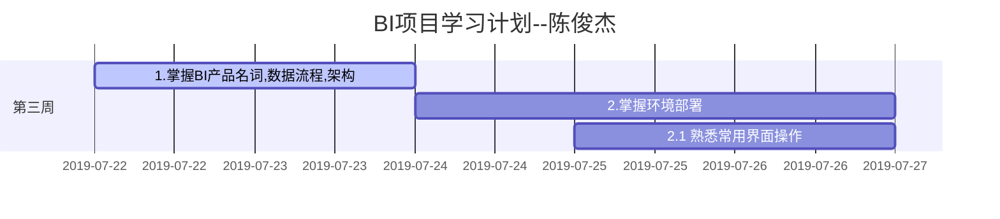

<h1 align="center">Winning实习规划</h1>

</br>

</br>

</br>




<!--3.掌握界面数据流程          : b, 2019-07-29,1d
​    3.1 界面显示问题的排错及定位 :f, after b,3d-->

</br>

<h2 align="center">目录</h2>

[TOC]


# 运营决策支持系统

## 指标管理


### 指标体系管理


#### 体系管理


##### 病案体系


##### 业务体系


#### 指标管理


##### 指标配置


##### 下钻配置


### 应用主题管理


#### 主题明细对应


### 指标规范管理

#### 指标规范管理


##### 指标规范维护


### 维度信息管理

#### 维度信息维护

- `界面功能：`
  - 维护指标维度基础字段信息

- `具体用法：`

```sql
select a.[事实表对应key],b.[维度表对应key名称],sum(fz) value from ([sql_middle]) a 
left join [关联维度表] b on a.[事实表对应key]=b.[维度表对应key]
group by a.[事实表对应key],b.[维度表对应key名称]
--其中[sql_middle]取自HD_ZBMX_HZ表指标对应的sql_middle字段，即指标对应语句
```

- `实例说明：`

以门急诊人次[A001]科室数据展示为例：其语句如下：

```sql
select a.kskey,b.ksmc,sum(fz) from 
(select kskey,sum(ghrc) fz from FACT_YY_MZ_JZRC where timekey between @kssj and @jssj and yykey in (@yykey) group by kskey) a 
left join DIM_KSXX b on a.kskey=b.kskey 
group by a.kskey,b.ksmc
```

> 注：指标维度下钻每个维度均需配置这些字段信息，否则维度数据将无法展示，如事实表新增了原库中不包含的维度字段，则需在此中配置字段信息，以便下钻或其他地方使用


## :star: Tips

- 善用局部搜索及导出功能

  

- 善用全局报表搜索

